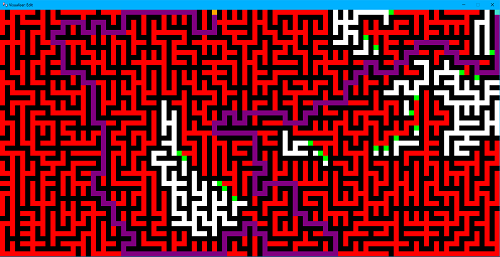
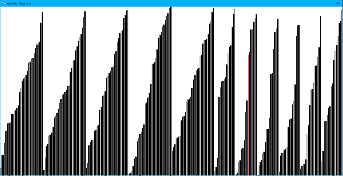

# Algorithm Visualiser

A simple tool built step by step visualization for path finding, maze creating and sorting algorithms. 

Over 35 algorithms visualized step by step! 

Watch the project video 

---

> Maze and Path Finding



>Sorting



---

## Supported Algorithms:

1) [Path Finding](Algorithms/algorithms.md)
1) [Maze generation](Algorithms/algorithms.md)
1) [Sorting](Sorts/algorithms.md)

---
## To run the application:

Install modules
```bash
pip install pygame
```

Run to get started right away!:
```bash
python app.py
```

---
## To use the tool:
> Different coloured squares represents the following:

|  Color 	|   Representation	|  
|---	|---	|
|   White	|  Empty Square 	|
|   Black	| Barrier  	|
|   Red	|   Visited	|
|   Green	|  To be visited 	|
|   Orange	|   Start Node	|
|   Teal	|   End Node	|
|   Purple	|   Shortest Path	|

> Basic Keys:

|   Key	|   Function	|
|---	|---	|
| Backspace  	|  Clear Screen (Maze)\Increase execution Speed (Both) 	|
|   Tab	|  Switch off or on grid (Both) 	|
|   Mouse Right Click	|   Clear node or obstacle (Maze)	|
|   Mouse Left Click	|   Add Node or obstacle (Maze)	|
|   Space	|  Shuffle (Sort)	|
|   R_Shift	| Invert (Sort) 	|
|   Escape	|  Return to previous page	|
|   h	|  Help	|

#### Note:
1) Maze algorithms don't work if start and end nodes are mentioned already.
2) Path finding algorithms work only if start and end nodes are mentioned.
3) Sort algorithms work only when lines are shuffled 